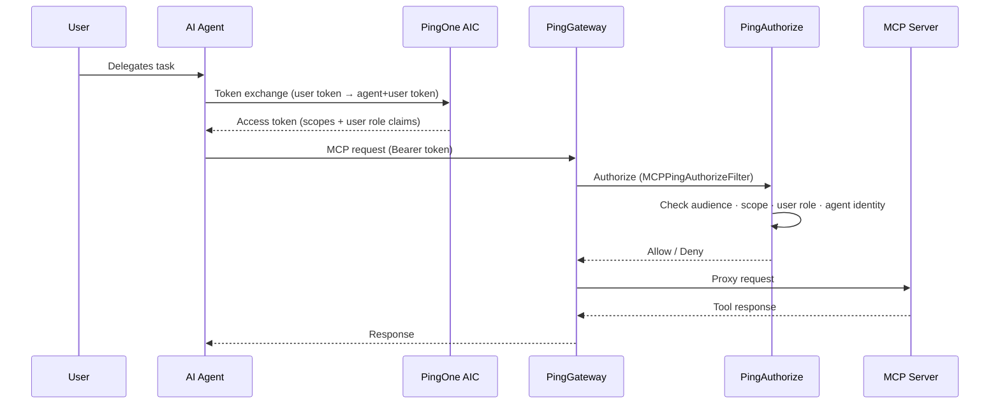
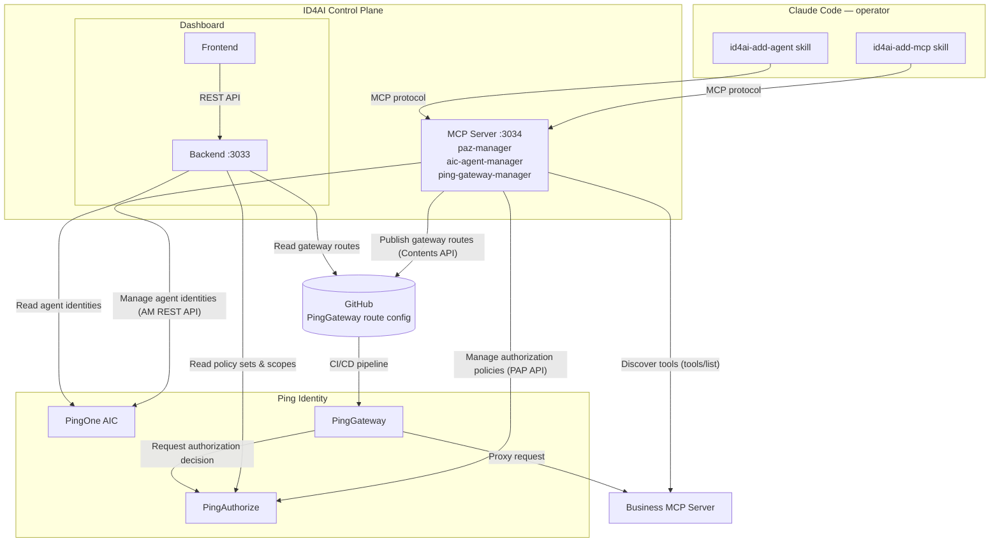
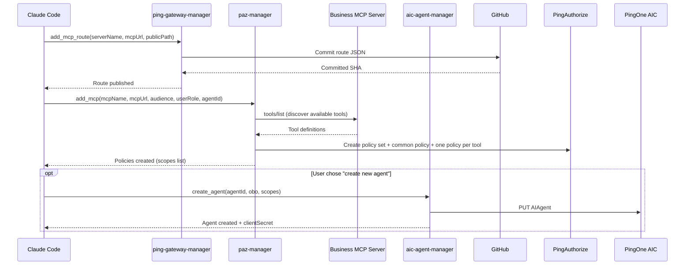
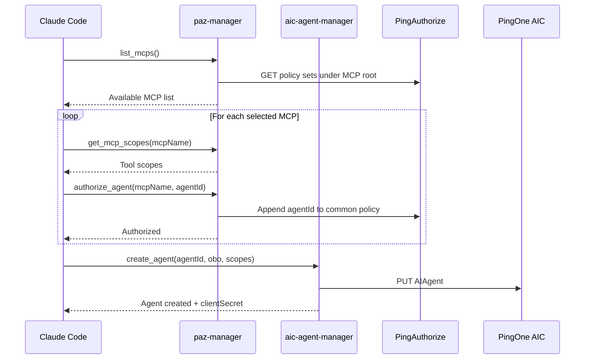

# ID4AI Control Plane

**Automate AI agent identity creation and MCP server protection across PingOne Advanced Identity Cloud, PingAuthorize, and PingGateway.**

The ID4AI Control Plane is a purpose-built system for automating the lifecycle management of AI Agents and the protection of the resources (MCP tools) accessed by the agents. It eliminates manual configuration across Ping Identity products by providing Claude Code skills that orchestrate the full lifecycle — from publishing a gateway route to issuing an OAuth2 client — as well as a live dashboard that shows the resulting access topology at a glance.

The following videos demonstrate the `id4ai-add-mcp` and `id4ai-add-agent` skills in action — from onboarding an MCP server and defining its authorization policies, to creating an agent identity and granting it access to tools, with the results reflected live in the dashboard.

**`/id4ai-add-mcp` — publish a PingGateway route and create authorization policies for an MCP server:**
<video src="https://github.com/user-attachments/assets/4805821c-c9ce-4f0a-9b95-9b347cdd5bbf" controls width="100%"></video>

**`/id4ai-add-agent` — create an agent identity in AIC and authorize it on selected MCP tools:**
<video src="https://github.com/user-attachments/assets/217abc62-5fa8-4034-a2bd-69cb283696bb" controls width="100%"></video>

---

## Runtime Protection Model

The Ping Identity reference architecture combines three products, each with a distinct role:

- **PingOne Advanced Identity Cloud (AIC)** — the identity authority. Issues OAuth2 tokens to agents via the token-exchange grant (OBO flow), embedding both the agent's identity and the delegating user's claims into a single access token.
- **PingGateway** — the enforcement point. Sits in front of every MCP server, intercepts each request, and calls PingAuthorize before proxying upstream. Agents never reach an MCP server directly.
- **PingAuthorize** — the policy decision point. Evaluates fine-grained rules (audience, scope, user role, agent identity) on every tool call and returns Allow or Deny to PingGateway in real time.

When an AI agent calls a protected MCP tool, every request passes through this chain:



Every tool call is gated by four independent checks in PingAuthorize: the token audience must match the MCP server, the token must carry the tool-specific scope, the user's role claim must satisfy the policy, and the agent identity must be explicitly authorized.

---

## Control Plane Architecture

The control plane consists of an MCP layer, a dashboard, and two Claude Code skills. The skills drive configuration forward; the dashboard shows the live state.



---

## Why This Exists

AI agents that call MCP servers need:

1. **An identity** — an OAuth2 client in AIC that can obtain tokens (via token exchange for OBO agents, or client credentials for autonomous agents).
2. **A protected route** — a PingGateway route that proxies the upstream MCP server and enforces authentication and authorization on every request.
3. **Fine-grained policies** — PingAuthorize policies that gate access per MCP tool, per agent identity, and per user role.

Setting this up by hand across three systems is error-prone and slow. This project automates the whole flow with two skills (`id4ai-add-mcp` and `id4ai-add-agent`) and three MCP servers that Claude Code uses to talk to each product.

---

## How It Works

### Onboarding an MCP Server — `id4ai-add-mcp`

Publishes a PingGateway route and creates a complete PingAuthorize policy set for a new MCP server.



### Onboarding an Agent — `id4ai-add-agent`

Creates an OBO agent identity in AIC and grants it access to one or more protected MCP servers.



---

## Protection Model

MCP tool access is represented as OAuth2 scopes following the pattern:

```
mcp:<server_name>:<tool_name>
```

Example: `mcp:crm:get_customer`. Every tool gets exactly one scope — no coarse-grained merging. Scopes are created automatically when an MCP server is onboarded (`add_mcp`) and assigned to agents when access is granted (`add_agent`).

PingAuthorize enforces three independent rules on every tool call:

| Rule | What it checks |
|------|---------------|
| **Validate Scope** | The token must carry `mcp:<server>:<tool>` |
| **Allow Subject** | The user's token must include the required role claim |
| **Allow Actor Subject** | The agent identity must be explicitly listed in the `common` policy |

All three must pass. Failing any one denies the request.

---

## Repository Layout

```
id4ai-control-plane/
├── mcp-server/          # Three MCP servers (paz-manager, aic-agent-manager, ping-gateway-manager)
├── dashboard/           # Single Vercel-ready dashboard project
│   ├── api/              # Express API and service integrations
│   ├── public/           # Single-page dashboard UI (vanilla JS)
│   └── dev.js            # Local dashboard launcher
├── id4ai-skills/        # Claude Code skills for the two primary workflows
└── scripts/             # Standalone CLI utilities for AIC agent management
```

For further details, see each subfolder's README below.

The dashboard is a standalone Vercel project: set its Vercel Root Directory to `dashboard`.

---

## Subfolders

| Folder | Description |
|--------|-------------|
| [mcp-server/](mcp-server/README.md) | The three MCP servers that Claude Code uses to automate configuration |
| [dashboard/](dashboard/README.md) | Single Vercel-ready dashboard with an Express API and static UI |
| [id4ai-skills/](id4ai-skills/README.md) | `id4ai-add-mcp` and `id4ai-add-agent` Claude Code skills |
| [scripts/](scripts/README.md) | CLI scripts for direct AIC agent management |

---

## Quick Start

### Prerequisites

- **PingAuthorize PAP** must be running and reachable at the URL you set in `PAZ_BASE_URL` (default `https://localhost:9443`). The MCP server writes policies directly to the PAP API — no PAP, no policy creation.
- **PingOne AIC** tenant with a service account configured (RS256 JWK, `fr:am:*` and `fr:idm:*` scopes).
- **PingGateway** with the `MCPPingAuthorizeFilter` and a CI/CD pipeline watching the GitHub route config repo.
- **GitHub repo** set up for PingGateway route config (see [Route Config Repo](#route-config-repo) below).
- **Claude Code** installed (`npm install -g @anthropic-ai/claude-code`).

---

### 1. Clone and configure

```bash
git clone https://github.com/carbonefederico/id4ai-control-plane.git
cd id4ai-control-plane

# Fill in environment variables for each service
cp mcp-server/.env.example mcp-server/.env && vi mcp-server/.env
cp dashboard/.env.example  dashboard/.env  && vi dashboard/.env
```

---

### 2. Start the servers

Each subfolder has its own `package.json`. Run in two separate terminals:

```bash
# MCP server (port 3034)
cd mcp-server && npm install && npm run dev

# Dashboard (port 3033)
cd dashboard && npm install && npm run dev
# Open http://localhost:3033
```

`npm run dev` loads `.env` automatically and restarts on file changes. Use `npm start` for production.

---

### 3. Register the MCP servers with Claude Code

Run once to add all three MCP servers to your global Claude Code config:

```bash
claude mcp add paz-manager          http://localhost:3034/ping-authorize/mcp      --transport http
claude mcp add aic-agent-manager    http://localhost:3034/aic-agent-manager/mcp   --transport http
claude mcp add ping-gateway-manager http://localhost:3034/ping-gateway-manager/mcp --transport http
```

Verify with `claude mcp list`.

---

### 4. Install the Claude Code skills globally

```bash
ln -s "$(pwd)/id4ai-skills/id4ai-add-mcp"   ~/.claude/skills/id4ai-add-mcp
ln -s "$(pwd)/id4ai-skills/id4ai-add-agent"  ~/.claude/skills/id4ai-add-agent
```

The skills are then available as `/id4ai-add-mcp` and `/id4ai-add-agent` in any Claude Code session.

---

### Route Config Repo

`ping-gateway-manager` commits PingGateway route JSON files to a GitHub repository that your gateway CI/CD pipeline watches. Create or designate a repo and ensure the target path exists:

```
<your-gateway-config-repo>/
└── config/
    └── routes/        ← set GITHUB_PATH to this (default: config/routes)
        └── .gitkeep
```

Set `GITHUB_OWNER`, `GITHUB_REPO`, `GITHUB_PATH`, and `GITHUB_TOKEN` in `mcp-server/.env`. Every call to `add_mcp_route` will commit a new JSON file here; PingGateway picks it up on the next reload.
